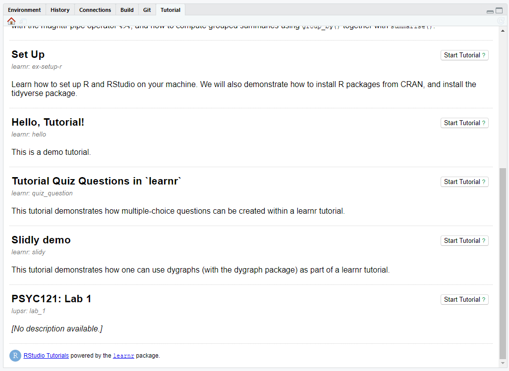

<!-- README.md is generated from README.Rmd. Please edit that file -->

# Lancaster University Psychology Stats in R (“lupsr”)

<!-- badges: start -->

<!-- badges: end -->

lupsr is a set of exercises and stats tuition content for use with
students in the Psychology Department at Lancaster University. The
exercises in lupsr are written with the package “learnr” which provides
interactive exercises that can be run either within the R Studio IDE or
in a local web browser. No knowledge of programming concepts or R / R
Studio is required. Follow the installation and usage below to get
started.

## Installation

lupsr is currently only available from [GitHub](https://github.com/)
with:

``` r
# install.packages("devtools")
devtools::install_github("tombeesley/lupsr")
#> Skipping install of 'lupsr' from a github remote, the SHA1 (ad8f31d3) has not changed since last install.
#>   Use `force = TRUE` to force installation
```

lupsr imports “learnr” and “tidyverse” packages at installation is these
are not already installed.

## Use

Load the required packages:

``` r
library(tidyverse)
library(learnr)
library(lupsr)
```

Browse the available tutorials in lupsr:

``` r
learnr::available_tutorials("lupsr")
#> Available tutorials:
#> * lupsr
#>   - lab_1 : "PSYC121: Lab 1"
```

Run a tutorial with:

``` r
learnr::run_tutorial("lab_1", package = "lupsr")
```

The above command will run the tutorial in a local browser window. It is
possible to have the tutorial run within the “Tutorial” pane (shared
with Environment/History). Click tutorial and browse the available
turorials there. Click “Start Tutorial” and it will run within the R
Studio IDE:



I am currently looking for a way to have the “run\_tutorial” command
also launch the tutorial in the IDE.
